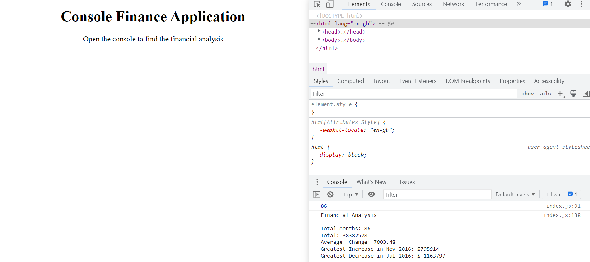

# Finance_Application JS Challenge

# Description
This console application was completed as a part of my front end web development bootcamp with Triology/edX. I was required to find the total months, average change, profits and losses in a set of nested arrays. It required me to use JavaScript to create nested loops and conditions. 
[Link to the deployed project]( https://al946x.github.io/Finance_Application/ "link to the deployed project")

# Screenshot

# Installation 
Click on the live link or access through the git hub repo

